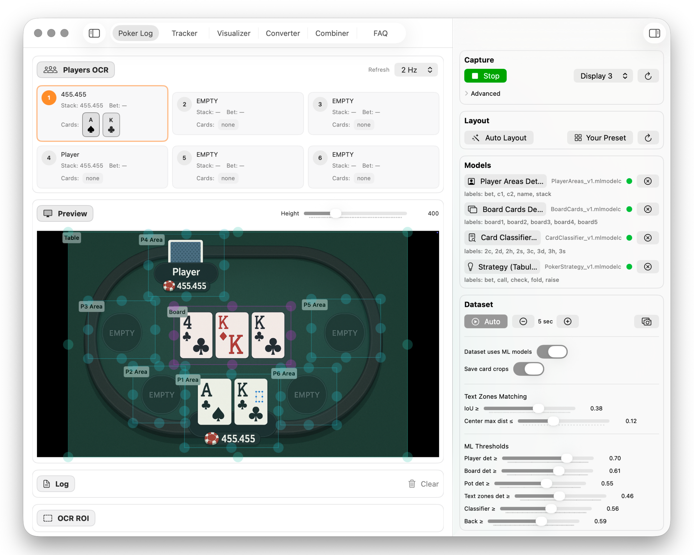
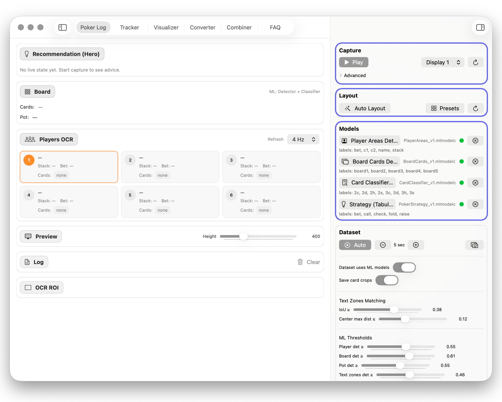
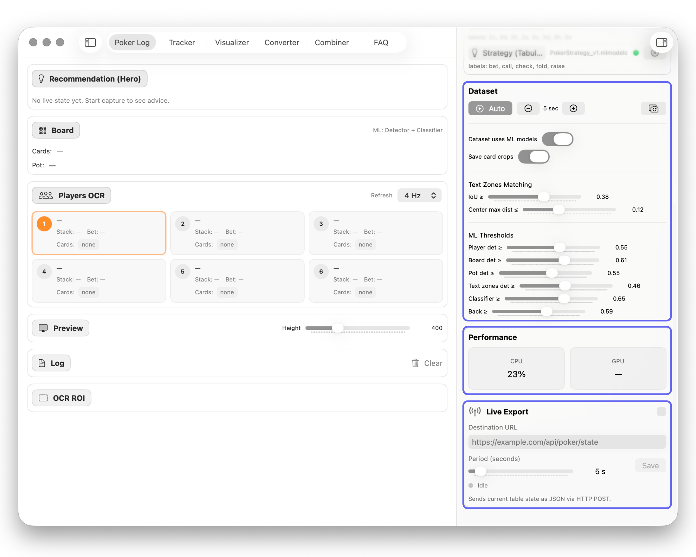
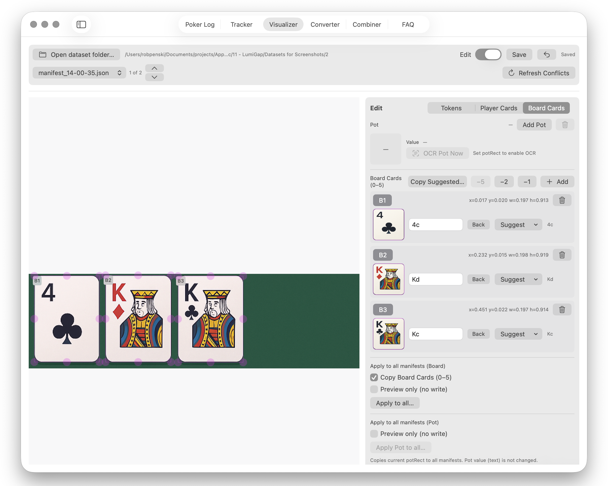
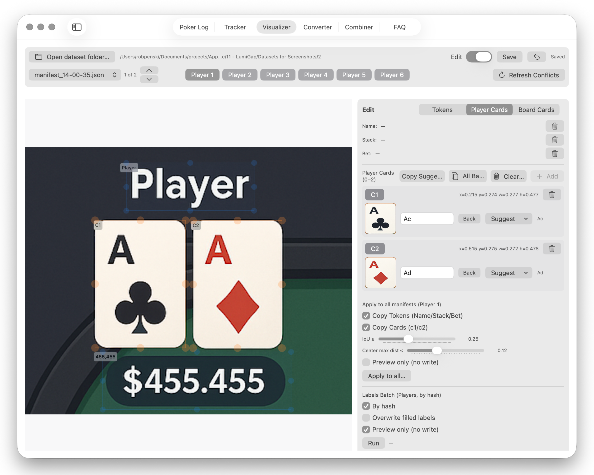

# LumiGap

> macOS tool for poker research and analysis.

LumiGap is a macOS product built for poker research and structured analysis. It is designed for players who want a more disciplined workflow for reviewing hands, collecting data, and improving through study.

## Project status

**Status:** Active  
**Type:** Desktop product  
**Code availability:** Private

## Platform / Availability

- Mac

## Key features

- Poker research workflow
- Analysis-focused desktop experience
- Structured study support
- Built for methodical review and improvement

## Screenshots

## Links

- Website: https://lumigap.com/en
- Portfolio page: https://roqd.one/p/lumigap
- GitHub repo: https://github.com/roqd-one/lumigap-poker-ai
- Main portfolio: https://roqd.one/
- GitHub profile: https://github.com/roqd-one

## Suggested GitHub topics

`macos`, `poker`, `poker-tools`, `analysis-tool`, `research-tool`, `desktop-app`

## Changelog

See [CHANGELOG.md](./CHANGELOG.md).

## Feedback / Issues

This repository serves as a public product page and lightweight documentation hub.

If you want to report a bug, suggest an improvement, or ask about the product, open an issue in this repository or use the contact path on the official website.

## Why this repo exists

This is a public showcase repository for LumiGap — a place for product overview, screenshots, links, and lightweight release notes.

## Source code

LumiGap is actively developed, but the application source code is private.

## Related projects

- [qdBox](https://github.com/roqd-one/qdbox-app)
- [AirMQTT](https://github.com/roqd-one/airmqtt-app)
- [PostFox](https://github.com/roqd-one/postfox)
- [AlcoList](https://github.com/roqd-one/alcolist)
- [NowAgo](https://github.com/roqd-one/nowago)
- [OrbiDeck](https://github.com/roqd-one/orbideck)

---
Part of the public product portfolio at https://roqd.one/
